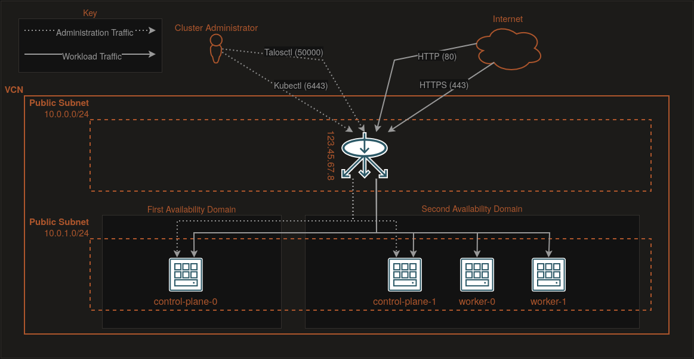

# Deploy a Kubernetes Cluster with Talos Linux on Oracle Cloud Infrastructure's (OCI) Free Tier

This project aims to deploy a four node Kubernetes cluster composed only of always free infrastructure resources on Oracle Cloud Infrastructure (OCI). For its underlying instance OS it uses [Talos Linux](https://www.talos.dev/), a secure, minimal, immutable and declarative OS intended solely for running Kubernetes clusters.

## Architecture

The cluster infrastructure is based on four nodes comprising two control plane nodes plus two worker nodes for workloads. An OCI Network Load Balancer distributes incoming traffic across the nodes for both cluster administration and receiving external traffic. The following diagram gives an overview of the architecture.

<p align="center"></p>

If deployed using the default configuration, the infrastructure created will be as per the above diagram. In particular:

 * An OCI **Virtual Cloud Network** (VCN) with an [RFC 1918 private address range](https://www.rfc-editor.org/rfc/rfc1918#section-3)
 * The VCN contains **two subnets**, a "public" one for the Network Load Balancer and a "private" one containing the VM instances which only have private IP addresses
   * This set up isolates the VM instances from the wider internet and allows ingress to be configured via the Network Load Balancer and associated Network Security Groups (NSGs)
 * The [**Network Load Balancer**](https://docs.oracle.com/en-us/iaas/Content/NetworkLoadBalancer/overview.htm) (NLB) in the public subnet exposes a single public IP address to allow ingress
   * TCP ports `6443` and `50000` are exposed on the NLB to the public subnet for administration of the cluster using [kubectl](https://kubernetes.io/docs/reference/kubectl/) and [talosctl](https://docs.siderolabs.com/talos/v1.12/getting-started/talosctl) respectively
   * A configurable set of ports (by default TCP ports `80` and `443`) are exposed on the NLB to the public subnet for allowing ingress to the cluster so workloads can be accessed. An ingress controller such as [traefik](https://doc.traefik.io/traefik/) must subsequently be installed to allow ingress for workloads, see the [Ingress](/docs/ingress.md) documentation for more details
   * Network Security Groups are used to ensure only traffic on the configured ports and from configured source IP addresses is allowed to be routed to the nodes
 * Two **control plane instances** with 12GB of RAM and 2 vCPUs each are spread evenly across all available availability domains within the chosen region
 * Two **worker instances** with 1GB of RAM and 1 vCPU all assigned to a single availability domain (AD) within the chosen region
   * This is a limitation of OCI's free tier as E2 Micro instances can only be created in a single, particular (AD) in each region. The required AD's index can be configured using the `worker_availability_domain` variable
   * To find out which AD must be used in your chosen region, you can find this information in the [instance creation](https://cloud.oracle.com/compute/instances/create) GUI with the `VM.Standard.E2.1.Micro` shape selected
 * Custom [Talos Linux](https://docs.siderolabs.com/talos/) instance images are created dynamically, from a customisable configuration (see the config patching section further down), and uploaded to an Object Storage bucket and used from there to create [OCI Custom Images](https://docs.oracle.com/en-us/iaas/Content/Compute/Tasks/managingcustomimages.htm) from which each node is built
   * The node images are ready for the [Longhorn](https://longhorn.io) storage solution, which uses the block storage of the OCI instances and allows for Kubernetes persistent volumes to be created out of this storage pool

### Talos Image Factory

To generate images suitable for running on particular hardware configurations and with particular extensions, Talos provides the [Talos Image Factory](https://factory.talos.dev/) ([documentation](https://docs.siderolabs.com/talos/v1.12/learn-more/image-factory)), a web interface that creates images on the fly for a given configuration known as a **schematic**.

The default images used in this project are created via Image Factory with the following options selected:

 - **Hardware Type:** Cloud Server
 - **Talos Linux Version:** 1.13.7
 - **Cloud:** Oracle Cloud
 - **Machine Architecture:** amd64/arm64
 - **System Extensions:**
   - siderolabs/iscsi-tools
   - siderolabs/util-linux-tools
 - **Extra kernel command line arguments:** none
 - **Bootloader:** auto

The schematic includes the `siderolabs/iscsi-tools` and `siderolabs/util-linux-tools` system extensions in order to allow [Longhorn](https://longhorn.io/docs/1.11.1/advanced-resources/os-distro-specific/talos-linux-support/) to be used for dynamic block storage in the Kubernetes cluster and CNI plugins for use by a service mesh. See the [Storage documentation](/docs/storage.md) and [Ingress documentation](/docs/ingress.md) for more details.

Every variation of the image schematic that gets created is identified by a consistent **schematic ID** (hash) that does not change across Talos versions. The images that this configuration uses are as follows, though you can provide your own schematic ID via the `image_factory_url_hash_control_plane` and `image_factory_url_hash_worker` Terraform variables described further down if you prefer to use one customised to your own needs.

 - [https://factory.talos.dev/image/613e1592b2da41ae5e265e8789429f22e121aab91cb4deb6bc3c0b6262961245/v1.13.7/oracle-amd64.qcow2]
 - [https://factory.talos.dev/image/613e1592b2da41ae5e265e8789429f22e121aab91cb4deb6bc3c0b6262961245/v1.13.7/oracle-arm64.qcow2]

## Configuration

### Terraform Variables

Your deployment can be configured via the variables outlined in the table below which also includes a number of mandatory variables that you need to set up as they are needed by the OCI Terraform provider. The [OCI documentation](https://docs.oracle.com/en-us/iaas/developer-tutorials/tutorials/tf-provider/01-summary.htm) gives a good overview of where the IDs and information are located and also explains how to set up Terraform.

All of these variables can be supplied to Terraform [in a number of ways](https://developer.hashicorp.com/terraform/language/values/variables#assign-values-to-variables). The easiest is either to add them to a file with the `.auto.tfvars` extension or to a `.env` environment file in the root directory of this project which the Taskfile will load in automatically (or you can load manually with `source .env`). 

#### `*.auto.tfvars` Variable File Example

```tfvars
compartment_id = "<COMPARTMENT_ID>"
fingerprint    = "<RSA_FINGERPRINT>"
region         = "<REGION_NAME>"
tenancy_ocid   = "<TENANCY_OICD>"
user_ocid      = "<USER_OICD>"
```

#### `.env` Variable File Example

```sh
export TF_VAR_compartment_id="<COMPARTMENT_ID>"
export TF_VAR_fingerprint="<RSA_FINGERPRINT>"
export TF_VAR_region="<REGION_NAME>"
export TF_VAR_tenancy_ocid="<TENANCY_OICD>"
export TF_VAR_user_ocid="<USER_OICD>"
```

#### Available Variables

| Variable               | Required? | Default Value | Description             |
|------------------------|-----------|---------------|-------------------------|
| `compartment_id`             | Yes | N/A           | The OCI Compartment ID |
| `control_plane_source_cidr`  | No  | `0.0.0.0/0`   | The source IP CIDR range from which access to the control plane will be allowed |
| `dns_label`                  | No  | `prod`        | A descriptive DNS name for the cluster |
| `fingerprint`                | Yes | N/A           | The fingerprint of the key to use for authenticating to OCI |
| `image_factory_url_hash_control_plane` | No | `613e1592b2da41ae5e265e8789429f22e121aab91cb4deb6bc3c0b6262961245` | The schematic ID of the image from the image factory for the control plane |
| `image_factory_url_hash_worker` | No | `613e1592b2da41ae5e265e8789429f22e121aab91cb4deb6bc3c0b6262961245` | The schematic ID of the image from the image factory for the workers |
| `port_kubectl`               | No  | `6443`        | The TCP port number to use for kubectl |
| `port_talosctl`              | No  | `50000`       | The TCP port number to use for Talos' API server |
| `ports_additional`           | No  | [ `{ protocol = "TCP", port = 80, backend_port = 30080, source_cidr = "0.0.0.0/0" }, { protocol = "TCP", port = 443, backend_port = 30443, source_cidr = "0.0.0.0/0" }, ]` | Additional ports to allow ingress traffic from on the internet |
| `private_key_path`           | Yes | N/A           | The path to the private key to use for authenticating to OCI |
| `region`                     | Yes | N/A           | The OCI region into which resources will be deployed |
| `rfc1918_cidr_block`         | No  | `10.0.0.0/16` | The RFC 1918 private IP address space to use for VCN |
| `subnet_private_cidr`        | No  | `10.0.1.0/24` | The IP subnet within the rfc1918_cidr_block to use for the private subnet |
| `subnet_public_cidr`         | No  | `10.0.0.0/24` | The IP subnet within the rfc1918_cidr_block to use for the public subnet |
| `talos_version`              | No  | `1.13.7`      | The version of Talos Linux to install. It's recommended to pin this to avoid future version bumps in this project causing issues |
| `tenancy_ocid`               | Yes | N/A           | The OCI tenancy OCID |
| `user_ocid`                  | Yes | N/A           | The OCI user OCID |
| `worker_availability_domain` | No  | `2`           | The availability domain number into which workers should be placed |
| `worker_count`               | No  | `2`           | The number of worker nodes to create |

### Talos Machine Config Patching

Each node in a Talos Linux cluster is configured using a [machine config](https://docs.siderolabs.com/talos/v1.13/reference/configuration/v1alpha1/config) file which is a collection of YAML-based configuration snippets that get merged together to form the final configuration bundle. When the Terraform is run, it will generate a default control plane and a worker machine config for you using the `talosctl gen config` command; these will be created at `compute/config/control-plane.yaml` and `compute/config/worker.yaml` respectively. The MachineConfig YAML specification/schema is versioned and the latest v1alpha1 version is defined [here](https://docs.siderolabs.com/talos/v1.13/reference/configuration/v1alpha1/config).

These two configuration files contain sane defaults for bootstrapping a working cluster. You are encouraged to review these two files to get an understanding of how the cluster is being configured, however, you should not modify these files directly. Instead, you should create a patch file in one of the following locations depending on whether you want the patch to apply to all nodes, just the control plane nodes or just the worker nodes respectively. None of these patch files are required to be created, but you can equally create all of them if you need to or just a subset, it entirely depends on your needs and any missing ones will be silently ignored.

 * `compute/patches/config-patch.yaml`
 * `compute/patches/config-patch-control-plane.yaml`
 * `compute/patches/config-patch-worker.yaml`

Talos [supports patching](https://docs.siderolabs.com/talos/v1.13/configure-your-talos-cluster/system-configuration/patching) using **strategic merge patches**, these are minimal YAML documents that contain the minimum amount of information to a) indicate which part of the MachineConfig is being targeted and b) what the expected updated values should be. If you have ever used [overlays in Kustomize](https://github.com/kubernetes-sigs/kustomize#2-create-variants-using-overlays) to patch base YAML documents, then this pattern will be familiar to you. Multiple documents can be provided in each file using YAML's `---` document separator.

There are two ways to define a strategic merge patch in Talos. Many configuration subsystems can be targeted using named documents which are YAML resource kinds (specifications) for specific groups of related configuration such as [ExtensionServiceConfig](https://docs.siderolabs.com/talos/v1.13/reference/configuration/extensions/extensionserviceconfig) for configuring Talos system extensions, [RegistryMirrorConfig](https://docs.siderolabs.com/talos/v1.13/reference/configuration/cri/registrymirrorconfig) for configuring a container registry mirror to use or [HostnameConfig](https://docs.siderolabs.com/talos/v1.13/reference/configuration/network/hostnameconfig) for configuring the nodes' hostnames, for example:

```yaml
apiVersion: v1alpha1
kind: HostnameConfig
auto: stable
```

These documents are all well documented at their respective links where you can discover which other document kinds are available too. Each document has a `kind`, `apiVersion` and sometimes a `name` field (which internally gets mapped to the resource's `.metadata.name` field after apply), Talos uses all of these to determine where to merge, patch or append the specified resource. Refer to the [patching documentation](https://docs.siderolabs.com/talos/v1.13/configure-your-talos-cluster/system-configuration/patching) for more details.

Alternatively, if no corresponding resource exists for what you would like to patch, you can provide a minimal MachineConfig with just the updated/additional configuration required such as this config which will add an `extraMount` for Longhorn to store data on each node:

```yaml
machine:
  kubelet:
    extraMounts:
    - destination: /var/lib/longhorn
      type: bind
      source: /var/lib/longhorn
      options:
      - bind
      - rshared
      - rw
```

Additionally, JSON patches can be provided as [**RFC6902 JSON patches**](https://www.rfc-editor.org/rfc/rfc6902) to provide more surgical precision in the adding, updating and removing of data, though they are a bit more involved and generally not required for most things so we will not cover them here.

#### Suggested Machine Config Patches

##### Allow Workloads to Run on Control Plane Nodes

By default, the control plane nodes are tainted to prevent regular workloads from being scheduled on them in order to provide isolation to the control plane components. However, as the two worker nodes that the OCI free tier allows are very under-powered compared to the two control plane nodes, you will probably want to remove this taint by adding the following to the `compute/patches/config-patch.yaml` file.

```yaml
# Do not taint the control plane nodes so that we can run workloads on them.
cluster:
  allowSchedulingOnControlPlanes: true
```

Conversely, you may want to create the worker nodes with a label/taint pair that prevent non-DaemonSet workloads from being scheduled on them. This is because the worker nodes in the free tier are very low resourced and so a lot of workloads can overwhelm the nodes and cause them to become unresponsive. To avoid this, we can use a nodeAffinity so that we only schedule workloads that we know will not cause issues as shown below. To achieve this, add the following YAML snippet (replace example.com with your own domain) to the `compute/patches/config-patch-worker.yaml` file.

```yaml
machine:
  nodeLabels:
    node-restriction.example.com/low-resource: "true"
  nodeTaints:
    node-restriction.example.com/low-resource: "true:PreferNoSchedule"
```

If you do wish to then run a workload on these tainted worker nodes, you must give the workload the following node affinity:

```yaml
...
spec:
  affinity:
    nodeAffinity:
      requiredDuringSchedulingIgnoredDuringExecution:
        nodeSelectorTerms:
        - matchExpressions:
          - key: node-restriction.example.com/low-resource
            operator: In
            values:
            - "true"
...
```

##### Longhorn

If you plan to run Longhorn on your cluster, then as per the [Longhorn documentation](https://longhorn.io/docs/1.9.0/advanced-resources/os-distro-specific/talos-linux-support/#data-path-mounts), you will need to add the following configuration to the `compute/patches/config-patch.yaml` file in order to provide access to the local storage on the host.

```yaml
machine:
  # https://longhorn.io/docs/archives/1.10.2/advanced-resources/os-distro-specific/talos-linux-support/#data-path-mounts
  kubelet:
    extraMounts:
    - destination: /var/lib/longhorn
      type: bind
      source: /var/lib/longhorn
      options:
      - bind
      - rshared
      - rw
```

## Deployment

Deploying the initial infrastructure is a straight-forward process as follows. There are [Taskfile](https://taskfile.dev/) build targets available if you prefer and have Taskfile installed, run `task --list-all` for a list of available tasks.

```sh
#  Firstly, start with a Terraform init to initialise the provider.
terraform init

# Secondly, create a new Terraform plan.
terraform plan -out .tfplan

# And finally, apply the plan.
terraform apply .tfplan
```

Note that it's very common to receive the error `Error: 500-InternalError, Out of host capacity` when trying to provision the two 12GB Ampere control plane nodes. This is because there is very rarely free capacity in the Oracle data centres that is available for use by free-tier customers. If you see this message, then you either have to wait and try again later, or you might want to try forcing both of the control plane instances into a specific availability domain which has capacity for them, or reducing the amount of RAM requested in `compute/locals.tf`. Alternatively, you can upgrade to a PAYG plan which gives you a higher priority when provisioning compute resources.

After around ten minutes, the OCI network and compute instances will have been created and be up and running. Your new cluster can then be administered using the talosctl and kubectl config files as follows:

```bash
# Check the state of your cluster's nodes.
kubectl --kubeconfig compute/config/kubeconfig get nodes -o wide

# View Talos' built-in TUI dashboard.
talosctl --talosconfig compute/config/talosconfig dashboard

# To avoid having to provide the config file to kubectl and talosctl each time,
# copy them to the expected default locations on your system.
mkdir ~/.kube/ ~/.talos/
cp compute/config/kubeconfig ~/.kube/config
cp compute/config/talosconfig ~/.talos/config
```

## Further Reading

The `docs/` directory contains documentation for further reading and extending the cluster's capabilities with the following:

 * [CI/CD](/docs/cicd.md) - Automating the deployment of resources into the cluster
 * [Ingress](/docs/ingress.md) - Receiving traffic into the cluster with Traefik
 * [Monitoring and Observability](/docs/monitoring_and_observability.md) - Get insights into the health and state of the cluster
 * [Service Mesh](/docs/service_mesh.md) - Leveraging Linkerd to handle in-cluster networking
 * [Secret Management](/docs/secret_management.md) - Securely deploying and using Secrets in the cluster
 * [Storage](/docs/storage.md) - Leveraging Longhorn for distributed block storage
 * [Upgrades](/docs/upgrades.md) - Keeping the cluster up-to-date

